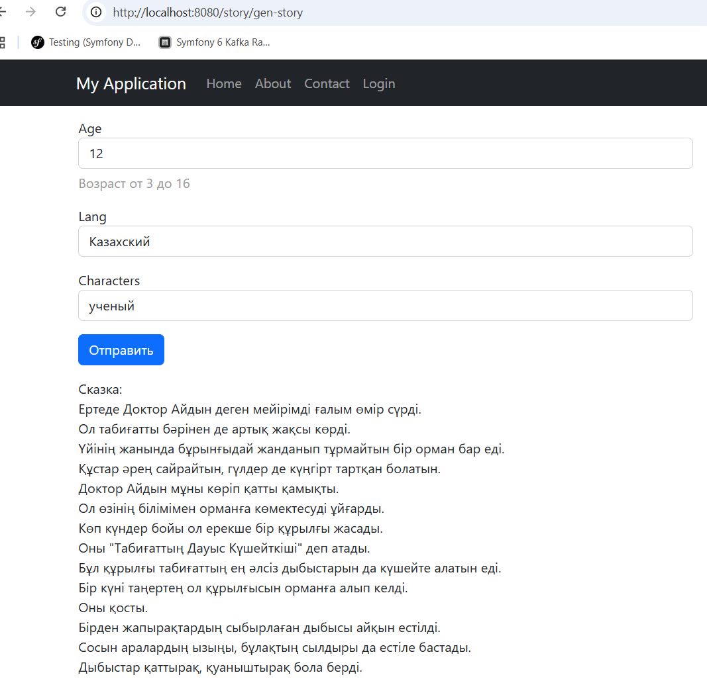

REQUIREMENTS
------------

The minimum requirement by this project template that your Web server supports PHP 8.1.

INSTALLATION
------------
Clone repository:
git clone https://github.com/web-dev137/tales.git

Set API key Gemini:
GEMINI_API_KEY="<your_api_key_here>"
in file /api/.env

Run the docker commands in the terminal:
docker-compose build --no-cache
docker-compose up -d

You can then access the application through the following URL:

   http://localhost:8080/story/gen-story

If you only would like to work with API then send query to:
http://localhost:8000/generate_story